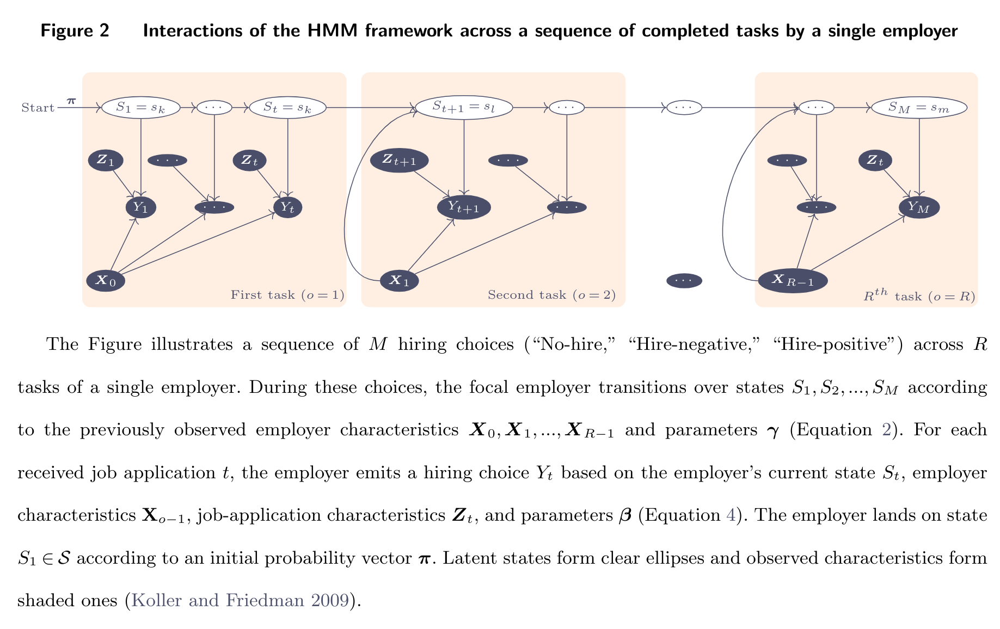
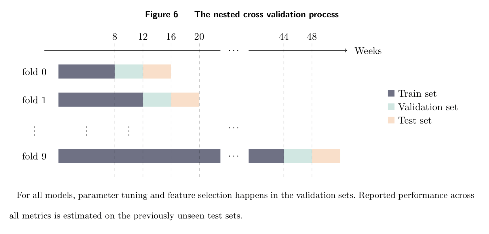

# The Good, the Bad, and the Unhirable: Recommending Job Applicants in Online Labor Markets

>  Relevant papers: 
>  
> - Journal version (working): http://kokkodis.com/files/gbu.pdf    
> - Conference version (published, earlier work): https://dl.acm.org/doi/abs/10.1145/3219819.3219881

## Implementation of different models

### The HMM implemntation

The implementation of the HMM can be found in two files:
* The **sklearn** extension class:  [hmm_gbu.py](src/python/hmm_gbu.py)
* The HMM functionality:  [hmm_functions.py](src/python/hmm_functions.py)

The conditional transitioning of Equation  (2) is implemented in [hmm_functions.py](src/python/hmm_functions.py) line 251. 

The transition and emission matrices `T,E` are formed in functions `get_transition_probs` and `get_emission_probs` of the [hmm_functions.py](src/python/hmm_functions.py) file. 

### The LSTM implementation

The implementation of the LSTM models can be found in two files:
* The **sklearn** extension class:  [lstm_sklearn.py](src/python/lstm_sklearn.py)
* The LSTM functionality:  [train_lstm.py](src/python/train_lstm.py)

### Implementation of single-assessment classifiers

The code for Logistic regression, Random forest, XGBoost, and SVM is in  [custom_util_functions.py](src/python/custom_util_functions.py)

### Implementation of many-assessment recommender systems

The code for the many-assessment recommender systems is in [many_assesment.ipynb](src/notebooks/many_assesment.ipynb)

## Training

The training for all models happens in the following files:
* HMM, XGBoost, Random Forest, SVM, Logistic Regression: [train.py](src/python/train.py)
* LSTM:  [train_lstm.py](src/python/train_lstm.py)
* SVD, CNN: [many_assesment.ipynb](src/notebooks/many_assesment.ipynb)

The training process (nested cross validation) is as follows:

To train these models, you can run the following files:

* [mainScript.sh](src/python/mainScript.sh) (requires cluster of nodes running Portable Batch System--PBS.)
  Note that for larger datasets the HMM and LSTM implementations will require a substantial amount of time to train---our university cluster's limit was 4 days,
  which in some cases we exceeded. The reason is that the feature selection process tests thousands of feature combinations three times 
  (i.e., for each label, see [do_feature_selection](src/python/custom_util_functions.py)). 
  A solution that we adapted was to split this search in steps: for instance, from 8-12 features, then from 13-18, etc. 
  Admittedly this approach might miss some combinations.
* [local_main_script.sh](src/python/local_main_script.sh) (you can run locally for logistic regression and SVM.)

This process will generate models and store them in the [trained_models](data/trained_models) directory. 
It will also post the results of the validation test inside the  [results_per_model](data/results_per_model). 

To generate a per-model results file that stores all the scores of the validation test you will need to run:

* [cat_results.sh](src/python/cat_results.sh) (on the remote server)
* [local_cat_results.sh](src/python/local_cat_results.sh) (locally)

## Results

The results are generated from the [analyze_results.ipynb](src/notebooks/analyze_results.ipynb) file.  

## Plots

All the plots are generated in the [R2-plots.pdf](src/R/R2-plots.pdf).

